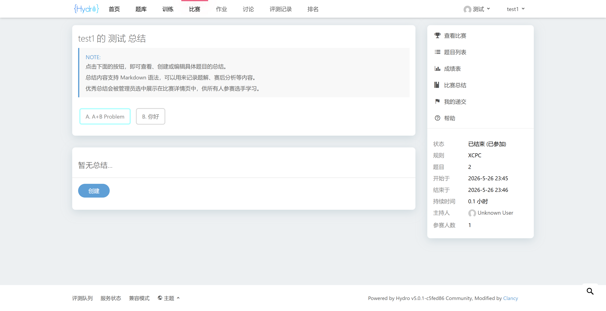
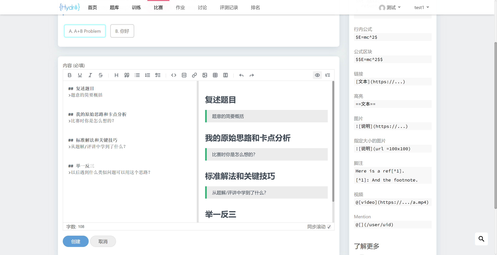
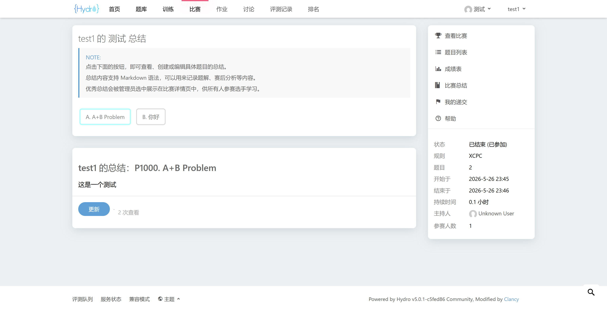
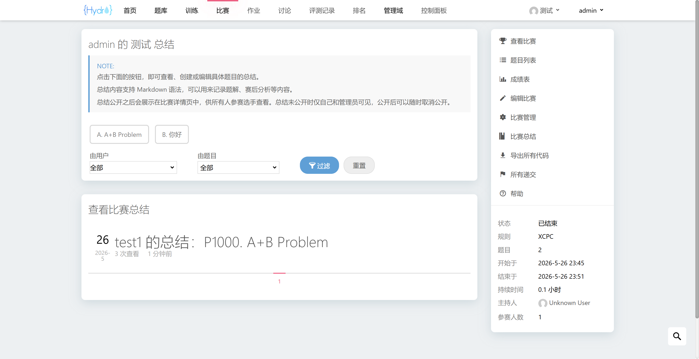
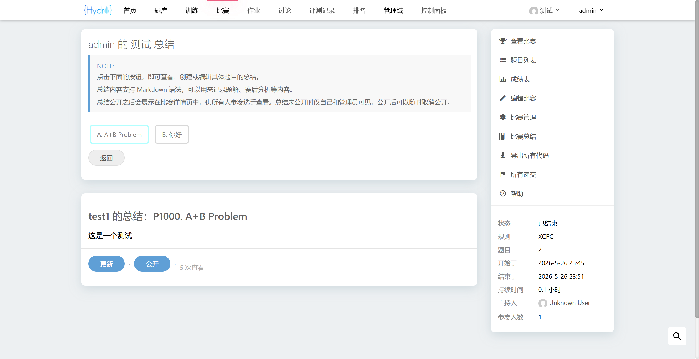
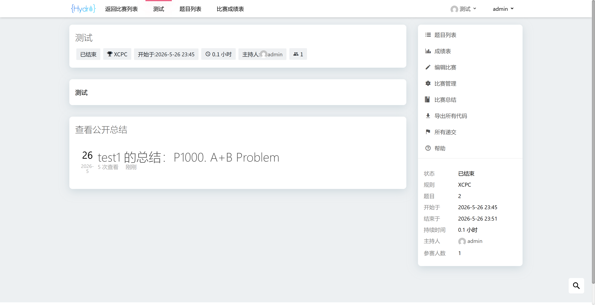

# Hydro 赛后总结插件

兼容 V5.0.1 社区版，不依赖任何额外插件和第三方库，安装方法见官方文档。

`/public` 中是 `README.md` 的截图，安装时可以放心删除。

## 普通用户功能

普通用户需要参加比赛才可以在赛后进行总结，对于异步比赛，Hydro 的计时是从打开题目列表的瞬间开始的，因此如果普通用户仅点击了参加比赛，但是没有打开题目列表，会被视为未参加，不能进行赛后总结。

1. 可以创建、更新、删除自己的私有总结
2. 可以查看比赛详情页的公开总结

## 管理员功能

拥有 `PRIV_MANAGE_ALL_DOMAIN` 权限的用户为管理员用户。

1. 可以查看所有参赛用户的私有总结
2. 可以按照用户或比赛题目进行筛选
3. 可以将用户的私有总结公开到比赛详情页，供其他用户查看学习
4. 可以取消已经公开到比赛详情页的总结，取消后仅创建者和管理员可见
5. 可以更新、删除所有用户的私有和公开总结
6. 拥有普通用户的所有功能

## 数据表

所有信息存储在全局表 `summary` 中，不会向任何原生数据表添加字段，便于迁移。

注意 `problemId` 字段对应题目的 `pid` 字段，路由也是按照 `pid` 进行匹配跳转的，在使用该插件时务必确保比赛中的题目有 `pid` 字段，否则将触发 `undefined` 错误。

|字段|类型|说明|
|:-:|:-:|:-|
|`domainId`|`string`|域 ID|
|`owner`|`number`|总结创建者 ID|
|`uname`|`string`|总结创建者用户名|
|`displayName`|`string`|创建者用户在域内的展示名|
|`contestId`|`ObjectId`|比赛 ID|
|`problemId`|`string`|题目的展示 ID，原生数据表已限制题目展示 ID 唯一|
|`pTitle`|`string`|题目的标题|
|`content`|`string`|总结文档的内容|
|`updateAt`|`Date`|最新修改日期|
|`views`|`number`|浏览量|
|`isPublic`|`boolean`|是否公开给其他参赛用户|

## 部分截图

